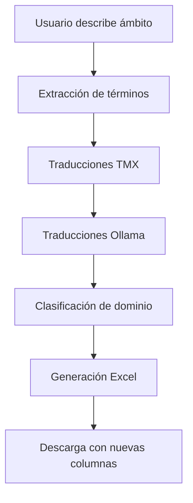

# Clasificación de Términos por Ámbito/Dominio

## Descripción

Esta nueva funcionalidad permite clasificar automáticamente los términos extraídos según su relevancia a un ámbito o dominio específico descrito por el usuario. Utiliza inteligencia artificial (Ollama) para determinar si cada término pertenece al contexto especializado definido.

## Características

### ✨ Funcionalidades Principales

- **Descripción de Ámbito**: El usuario puede describir el dominio específico de trabajo
- **Clasificación Automática**: IA determina la relevancia de cada término al ámbito
- **Puntuación de Confianza**: Cada clasificación incluye un porcentaje de confianza
- **Explicación**: Razón breve de por qué el término es o no relevante
- **Integración Completa**: Se integra con el flujo existente de traducciones

### 📊 Nuevas Columnas en Excel

1. **Relevancia Ámbito**: "Sí", "No", o "Incierto"
2. **Confianza Ámbito**: Porcentaje de confianza (0-100%)
3. **Razón Ámbito**: Explicación breve de la clasificación

## Uso

### 1. Interfaz Web

1. **Subir TMX**: Sube tu memoria de traducción como siempre
2. **Configurar Idiomas**: Selecciona idiomas origen y destino
3. **Describir Ámbito**: En la nueva sección "Ámbito de Especialización":
   - Describe tu dominio específico (ej: "medicina cardiovascular", "ingeniería de software")
   - Activa "Clasificar términos por relevancia al ámbito"
4. **Procesar**: Continúa con la extracción normal
5. **Descargar**: El Excel incluirá las nuevas columnas de clasificación

### 2. API REST

#### Endpoint de Clasificación Directa

```http
POST /api/ollama/classify-domain
Content-Type: application/json

{
  "terms": ["algoritmo", "usuario", "base de datos"],
  "domain_description": "ingeniería de software",
  "language": "es"
}
```

#### Extracción TMX con Dominio

```http
POST /api/extract-tmx-language
Content-Type: application/json

{
  "tmx_id": "tu-tmx-id",
  "language": "es",
  "target_language": "en",
  "use_termsuite": true,
  "domain_description": "medicina cardiovascular"
}
```

## Ejemplos

### Medicina Cardiovascular

**Descripción del ámbito**: "medicina cardiovascular"

| Término | Relevancia | Confianza | Razón |
|---------|------------|-----------|-------|
| cardiovascular | Sí | 95% | Término específico del dominio médico cardiovascular |
| presión arterial | Sí | 90% | Concepto fundamental en cardiología |
| usuario | No | 15% | Término genérico no específico del dominio médico |
| sistema | Incierto | 40% | Puede referirse a sistemas corporales o tecnológicos |

### Ingeniería de Software

**Descripción del ámbito**: "ingeniería de software"

| Término | Relevancia | Confianza | Razón |
|---------|------------|-----------|-------|
| algoritmo | Sí | 90% | Concepto fundamental en programación |
| base de datos | Sí | 85% | Componente esencial en desarrollo de software |
| usuario | Incierto | 45% | Puede ser usuario final o concepto de negocio |
| corazón | No | 10% | Término médico no relacionado con software |

## Configuración Técnica

### Requisitos

- **Ollama**: Servidor Ollama ejecutándose y accesible
- **Modelo**: Modelo de lenguaje compatible (ej: llama3.2:latest)
- **Conectividad**: Acceso de red al servidor Ollama

### Variables de Entorno

```bash
OLLAMA_HOST=192.168.0.88          # Host del servidor Ollama
OLLAMA_PORT=11434                 # Puerto del servidor Ollama
OLLAMA_MODEL=llama3.2:latest      # Modelo a utilizar
OLLAMA_BATCH_SIZE=5               # Términos por lote
OLLAMA_TIMEOUT=30                 # Timeout en segundos
```

### Optimizaciones

- **Caché**: Las clasificaciones se almacenan en caché para evitar repetir consultas
- **Procesamiento en Lotes**: Múltiples términos se procesan concurrentemente
- **Reintentos**: Sistema de reintentos automáticos en caso de errores temporales

## Flujo de Procesamiento



## Casos de Uso

### 1. Terminología Médica
- **Ámbito**: "cardiología pediátrica"
- **Beneficio**: Identificar términos específicos vs. términos médicos generales

### 2. Documentación Técnica
- **Ámbito**: "desarrollo de APIs REST"
- **Beneficio**: Separar terminología técnica de términos de negocio

### 3. Traducción Legal
- **Ámbito**: "derecho mercantil internacional"
- **Beneficio**: Distinguir términos jurídicos especializados

### 4. Ingeniería Industrial
- **Ámbito**: "automatización de procesos manufactureros"
- **Beneficio**: Identificar terminología técnica específica del sector

## Limitaciones

- **Dependencia de Ollama**: Requiere servidor Ollama funcionando
- **Calidad del Modelo**: La precisión depende del modelo de IA utilizado
- **Descripción del Ámbito**: La calidad de la clasificación depende de qué tan bien se describa el dominio
- **Idioma**: Funciona mejor con idiomas bien soportados por el modelo

## Solución de Problemas

### Ollama No Disponible
```
Error: Servicio Ollama no disponible
```
**Solución**: Verificar que Ollama esté ejecutándose y accesible en la URL configurada

### Clasificaciones Incorrectas
**Problema**: Los términos se clasifican incorrectamente
**Solución**: 
- Mejorar la descripción del ámbito (ser más específico)
- Verificar que el modelo de Ollama sea adecuado
- Considerar usar un modelo más grande o especializado

### Procesamiento Lento
**Problema**: La clasificación tarda mucho tiempo
**Solución**:
- Reducir `OLLAMA_BATCH_SIZE`
- Aumentar `OLLAMA_TIMEOUT`
- Usar un servidor Ollama más potente

## Pruebas

Ejecutar el script de pruebas:

```bash
cd termsuite-api
python test_domain_classification.py
```

Este script verifica:
- Conexión con Ollama
- Funcionalidad de clasificación
- Ejemplos de uso

## Desarrollo Futuro

### Mejoras Planificadas

1. **Filtrado por Relevancia**: Opción para mostrar solo términos relevantes
2. **Múltiples Dominios**: Clasificación contra varios ámbitos simultáneamente
3. **Aprendizaje**: Mejora de clasificaciones basada en feedback del usuario
4. **Modelos Especializados**: Soporte para modelos específicos por dominio
5. **Exportación Personalizada**: Columnas configurables según necesidades

### Integración con Otras Funcionalidades

- **Filtros Avanzados**: Combinar con filtros de frecuencia y longitud
- **Estadísticas**: Métricas de distribución por relevancia
- **Visualización**: Gráficos de relevancia por dominio